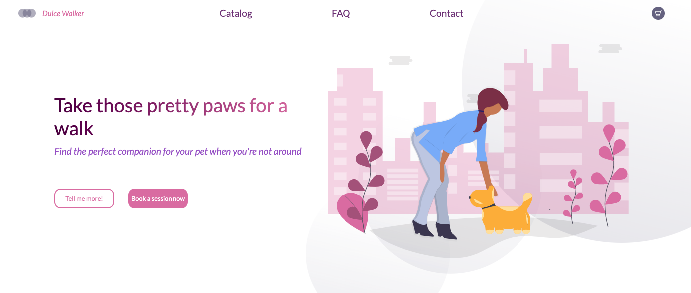

# 💻 Dulce Walker (BETA)

Landing page for a dog walker agency.



## ✨ Live Demo

You can look at it [here](https://misselliev.github.io/dulce-walker/).


## 🚀 Getting Started

To get a local copy up and running follow these simple example steps.


### Clone

```sh
git clone git@github.com:misselliev/dulce-walker.git
cd dulce-walker
```

### Install

```sh
npm install 
```

### Usage

```sh
npm run serve
```

## :pencil2: Todo
- Navbar pages to be added.

## Author

👤 Elizabeth Villalejos

- [Github](https://github.com/misselliev)
- [Linkedin](https://linkedin.com/ellievillalejos)
- [Dev.to](https://dev.to/misselliev)
- [Twitter](https://twitter.com/miss_elliev/)
- [Instagram](https://www.instagram.com/miss_elliev/)
- [Email](mailto:elizabeth.villalejos@gmail.com?subject=Website%20Inquiry)


## 🤝 Contributing

Contributions, issues and feature requests are welcome!

Feel free to check the [issues page](issues/).


## Show your support

Give a ⭐️ if you like this project!

> “What simple action could you take today to produce a new momentum toward success in your life?” Tony Robbins

